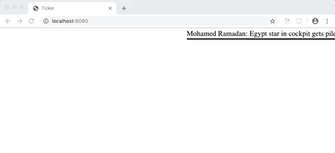

# Twitter Ticker

This small full-stack project pulls the latest headlines from the Twitter accounts of BBC World, Forbes, and Scientific American and displays them as a news ticker that runs from right to left. This was one of my first full-stack projects while a student at [SPICED Academy](https://spiced.academy/program/full-stack-web-development/).

## Demo (click to try for yourself)

## Built with

HTML, CSS, JavaScript (jQuery), Node.js (Express), Twitter API, AJAX, Base64 Encoding, Promises

## Features

-   As soon as the page loads, headlines come onscreen from the right
-   Headlines follow one after the other until beginning again in a loop
-   Only tweets that do not include other media (e.g. videos) are included
-   Requests for tweets are made to all three news sources simultaneously
-   The source of each headline is appended to it in parentheses
-   Each headline is a hyperlink to the corresponding article
-   When users hover over a headline, the animation stops

## Goals of Project

-   Making API requests and handling the returned data
-   Gaining experience using Node.js and `res.json()`
-   Practicing using `requestAnimationFrame()` and `cancelAnimationFrame`
